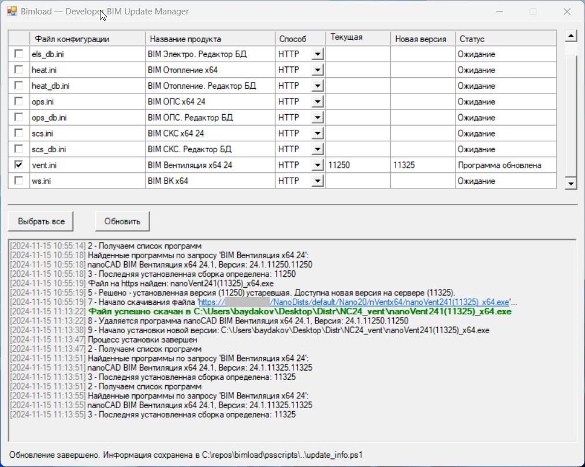

# Скрипт автоматического обновления ПО

Скрипт *bimload* автоматизирует получение новых версий ПО с FTP-сервера (или http-сервера) и дальнейшую переустановку ПО. Скрипт использует средство автоматизации **Windows PowerShell** от Microsoft.

Графический интерфейс:  

 
 

# Содержание

1. [Зачем](#зачем)
2. [Ввод данных](#ввод-данных)
3. [Что нужно для запуска](#что-нужно-для-запуска)
4. [Используемые технологии](#используемые-технологии)
5. [Проблемы проекта](#проблемы-проекта)

# Зачем

При разработке новые сборки ПО появляются часто. Есть польза от использования именно последней сборки. Однако неприятная рутина о скачивании, удалении и установке новой версии, а также затраты времени мешают наладить процесс по регулярной установке новой версии. Скрипт *bimload* решает такую проблему.

# Как это работает

Определение версии программ на FTP-сервере (или на http-сервере) происходит по цифре в имени **.exe*-файла. В случае изменения правил именования файлов на сервере или при изменении путей на сервере нужно внести изменения в текстовые конфигурационные файлы `*.ini`.

Если дистрибутив уже был скачан до запуска скрипта и был размещен на локальном диске в нужной папке с нужным именем, скачивание не будет происходить — программа установится с диска. 

Чтобы добавить еще одну программу в список обновляемых при работе скрипта, нужно создать файл `любое_имя.ini` и положить его в папку `/creds/`. В этом репозитории в качестве примера даны файлы в папке `/creds-sample/`, в которых приведены примеры настроек для применения программы с FTP-сервером и http-сервером.

Поиск и удаление программ на локальной машине устроено на основе инструмента Windows для управления Windows (WMI, Windows Management Infrastructure). 

Установка программ происходит вызовом в PowerShell команды:  
`C://.../дистрибутив.exe /quiet`,  
при этом лицензирование проходит штатно и в дальнейшем указания серийного номера не потребуется.

### Функционал
- чтение установленных в Windows версий требуемой программы
- подключение к FTP-серверу с указанием логина и пароля (или скачивание html-страницы в случае http-сервера) и чтение доступных версий требуемой программы
- скачивание дистрибутива или использование уже скачанного ранее файла
- удаление старшей версии установленной программы
- установка новейшей сборки программы
- обновление нескольких программ в один запуск
- сохранение списка программ для обновления.

### Способы запуска

Скрипт запускается вручную через ярлык. Запросов к пользователю во время работы скрипта нет. Теоретически, возможно добавление в автозагрузку.

### Особенности

Во время работы скрипта переустанавливаемая программа должна быть закрыта.  

# Ввод данных

Вся настройка данных производится в текстовых файлах **.ini**в папке **/creds/**. 

В репозитории хранятся примеры настроечных данных в папке **/creds-sample/**. При использовании этих файлов в работе, можно просто переименовать эту папку в **/creds/** перед использованием, а файлы в ней донастроить на собственные пути и собственное имя сервера. 

Используется три типа настроечных данных:

* **Общие данные** - данные для определения текущей версии программы, сохранения файлов, поиска уже скачанных файлов а также для определения версии программы по ее имени на сервере.  
    `localPath=` - адрес локальной директории, где лежит или куда будет скачан дистрибутив с программой  
    `productName=` - текстовый запрос к Windows Management Instrumentation, по которому будет найдена программа (или несколько программ) для переустановки с выбором старшей версии сборки  
    `fileVersionPattern=` - регулярное выражение, по которому из имени *.exe*-файла будет определяться версия сборки. Регулярное выражение должно возвращать версию сборки в первой захваченной группе. Регистр не учитывается   
    `productVersionPattern=` - регулярное выражение, по которому из номера версии, полученному от Windows Management Instrumentation (например, *24.6677.6677*) будет определяться версия сборки (*6677*). Правила такие же, как для `fileVersionPattern`

* **FTP данные** - данные для доступа к FTP-серверу и поиска файлов на нем. При работе с HTTP эти данные не нужны.  
    `ftpUrl=` - адрес сервера и порт в формате *ftp://1.2.3.4:2121*  
    `ftpFolder=` - адрес директории на FTP, без имени сервера, где лежит дистрибутив с программой. Для обновления будет использован последний по алфавитной сортировке файл       
    `username=` - имя пользователя  
    `password=` - пароль   

* **HTTP данные** - данные для доступа к HTTP-серверу и поиска файлов на нем. При работе с FTP эти данные не нужны.  
    `httpUrl=` - адрес сервера, где лежит файл в формате *https://myserver.ru/distrs/*  
    `httpPattern=` - регулярное выражение, по которому из html-текста страницы будет определяться имя файла с последней версией сборки. Используется последнее совпадение, возвращаемое этим регулярным выражением.

Настроечные файлы могут иметь любое имя, но должны иметь расширение *.ini*. Строки, начинающиееся с *#*, считаются комментариями. Порядок следования строк не имеет значения.     

# Что нужно для запуска

Для первого запуска нужно:

- Добавить необходимую информацию в настроечные файлы как описано выше
- Изменить путь для свойства *Объект* во вкладке *Ярлык* для ярлыка **bimload.lnk**, как указано на скриншоте. Путь должен вести к файлу **bimload_ftp.ps1** или **bimload_http.ps1**, который лежит по соседству. Путь настраивается здесь:

    

- Проверить установку чекбокса *Запуск от имени администратора* в окне, открывающемся по нажатию на кнопку *Дополнительно*, там же. Скриншот:

    

- Запустить **bimload.lnk** и разрешить изменения в Windows

# Используемые технологии

* [.NET Framework](https://learn.microsoft.com/ru-ru/dotnet/framework/)
* [Windows Forms](https://learn.microsoft.com/ru-ru/dotnet/desktop/winforms/overview/?view=netdesktop-8.0)
* [Windows PowerShell](https://github.com/PowerShell/PowerShell)
* [Windows Management Instrumentation (Инструментарий управления Windows)](https://learn.microsoft.com/ru-ru/windows/win32/wmisdk/wmi-start-page) 
* [Windows Script Host (Сервер сценариев Windows)](https://learn.microsoft.com/en-us/previous-versions/windows/it-pro/windows-server-2003/cc738350(v=ws.10))
* [File Transfer Protocol](https://datatracker.ietf.org/doc/html/rfc959)
* [Hypertext Transfer Protocol](https://httpwg.org/specs)
* [Регулярные выражения](https://learn.microsoft.com/ru-ru/dotnet/standard/base-types/regular-expression-language-quick-reference)

# Проблемы проекта

* Программа не может отследить ошибки при установке, т.к. они не выдаются в PowerShell при используемом методе установки. Для скрипта все выглядит так, будто программа установилась. Узнать, почему программа не переустановилась, можно будет только при ручном повторном запуске **.exe*. Встречались такие:
    - отсутствует необходимая версия Платформы  
    - установщик выдает "Программа уже установлена" из-за некорректного удаления предыдущей версии
    - установщик выдает "Файл не является 7z архивом", если предыдущее скачивание не было завершено до конца, и скрипт пытался установить недоскачанный файл (эта ошибка выдается явно, так что ее не пропустишь)
* Во время работы скрипт может остановить выполнение, пока в терминале не будет нажат Enter. Кажется, это происходит, когда с окна терминала снимается фокус на другое окно

# Todo

* Нет туду