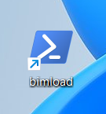
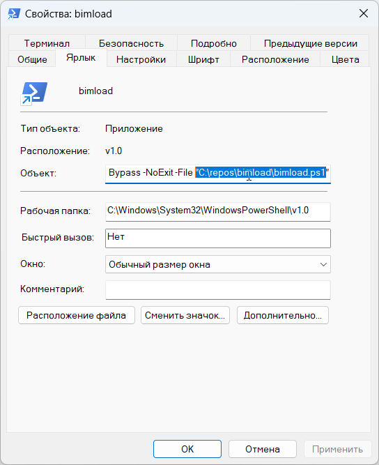
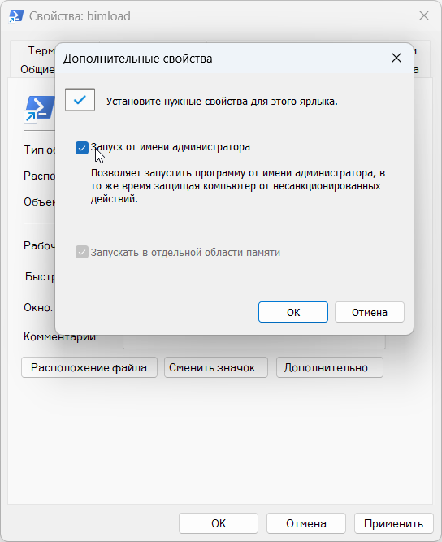

# Скрипт автоматического обновления ПО

Скрипт *bimload* автоматизирует получение новых версий ПО с FTP-сервера и дальнейшую переустановку ПО. Скрипт использует средство автоматизации **Windows PowerShell** от Microsoft.

Пример вывода скрипта в терминал при успешной работе:

# Содержание

1. [Зачем](#зачем)
2. [Ввод данных](#ввод-данных)
3. [Что нужно для запуска](#что-нужно-для-запуска)
4. [Используемые технологии](#используемые-технологии)
5. [Проблемы проекта](#проблемы-проекта)

# Зачем

При разработке новые сборки ПО появляются часто. Есть польза от использования именно последней сборки. Однако неприятная рутина о скачивании, удалении и установке новой версии, а также затраты времени мешают наладить процесс по регулярной установке новой версии. Скрипт *bimload* решает такую проблему.

# Как это работает

Определение версии программ на FTP-сервере происходит по цифре в имени файла. При изменении правил именования файлов или размещения директорий нужно внести изменения в `*.credentials`.

Если файл уже скачан и лежит на локальном диске, скачивание не будет происходить. Чтобы добавить программу в работу к скрипту, нужно предварительно добавить файл `*.credentials` в папку `/creds/`.

Поиск и удаление программ на локальной машине устроено на основе инструмента Windows для управления Windows (WMI, Windows Management Infrastructure). 

Установка программ происходит вызовом команды   
`C://.../дистрибутив.exe /quiet`,  
при этом лицензирование проходит штатно и в дальнейшем указания серийного номера не требуется.

### Функционал
- чтение установленных в Windows версий требуемой программы
- подключение к FTP-серверу и чтение доступных версий требуемой программы
- скачивание дистрибутива с FTP или использование уже скачанного ранее файла
- удаление старшей версии установленной программы
- установка новейшей сборки программы
- обновление нескольких программ в один запуск.

### Способы запуска

Скрипт может быть добавлен в автозагрузку или запускаться вручную. Запросов к пользователю во время работы скрипта нет. 

### Особенности

Во время работы скрипта переустанавливаемая программа должна быть закрыта.  
При преждевременном закрытии скрипта следующий запуск может происходить с чрезмерно медленной загрузкой 100 Кб/с.

Скриншоты с различными сценариями, отработанными на тесте скрипта, см. в папке [/git/readme/](/git/readme/).

# Ввод данных

Вся настройка данных производится в текстовых файлах в папке **/creds/**. 

В репозитории хранится пример настроечных данных в папке **/creds-sample/**. При использовании этих файлов в работе, папку нужно переименовать в **/creds/** перед использованием. 

Используется два типа настроечных файлов:
* **/creds/ftp** - файл с данными для доступа к серверу. Файл этого типа только один.  

    Содержимое:    
    `ftpUrl=` - адрес сервера и порт  
    `username=` - имя пользователя  
    `password=` - пароль   

* **/creds/any-name.credentials** - файлы с данными программы для переустановки. Этих файлов может быть любое количество. Они должны иметь расширение в виде *.credentials*, чтобы скрипт их обнаружил.
 
    Содержимое:  
    `ftpFolder=` - адрес директории на ftp, где лежит дистрибутив с программой  
    `localPath=` - адрес локальной директории, где лежит или куда будет скачан дистрибутив с программой  
    `productName=` - текстовый запрос к Windows Management Instrumentation, по которому будет найдена программа (или несколько программ) для переустановки с выбором старшей версии сборки  
    `fileVersionPattern=` - регулярное выражение, по которому из имени файла на FTP будет определяться версия сборки  
    `productVersionPattern=` - регулярное выражение, по которому из номера версии, полученному от Windows Management Instrumentation (например, *24.6677.6677*) будет определяться версия сборки (*6677*)

# Что нужно для запуска

Для первого запуска нужно:

- Добавить необходимую информацию в настроечные файлы как описано выше
- Изменить путь для свойства *Объект* во вкладке *Ярлык* для ярлыка **bimload.lnk**, как указано на скриншоте. Путь должен вести к файлу **bimload.ps1**, который лежит по соседству. Скриншот:

    

- Проверить установку чекбокса *Запуск от имени администратора* в окне, открывающемся по нажатию на кнопку *Дополнительно*, там же. Скриншот:

    

- Запустить **bimload.lnk** и разрешить изменения в Windows

# Используемые технологии

* [Windows PowerShell](https://github.com/PowerShell/PowerShell)
* [Windows Management Instrumentation](https://learn.microsoft.com/ru-ru/windows/win32/wmisdk/wmi-start-page) 
* [File Transfer Protocol](https://datatracker.ietf.org/doc/html/rfc959)
* [Регулярные выражения](https://learn.microsoft.com/ru-ru/dotnet/standard/base-types/regular-expression-language-quick-reference)

# Проблемы проекта

* Программа не может отследить ошибки при установке, т.к. они не выдаются в PowerShell при используемом методе установки. Встречались такие:
    - отсутствует необходимая версия Платформы  
    - установщик выдает "Программа уже установлена" из-за некорректного удаления предыдущей версии

