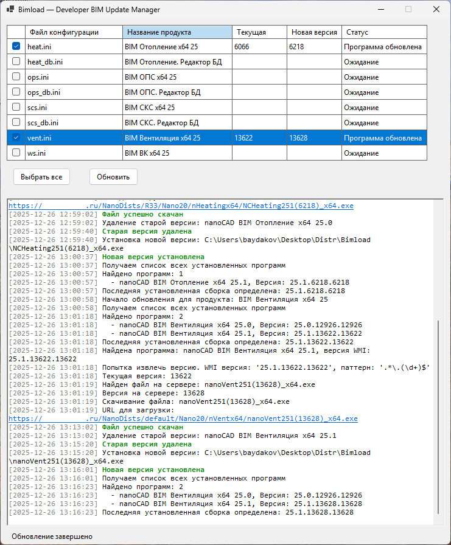

# Bimload

Приложение для автоматического обновления программного обеспечения на Windows.

## Основной функционал

- **Автоматическое обнаружение установленных программ** через Windows Management Instrumentation (WMI)
- **Получение информации о новых версиях** с HTTP/HTTPS серверов
- **Сравнение версий** и определение необходимости обновления
- **Скачивание дистрибутивов** с автоматическим определением последней версии
- **Удаление старых версий** программ
- **Установка новых версий** с тихой установкой
- **Пакетное обновление** нескольких программ за один запуск
- **Сохранение состояния** выбранных программ для обновления

## Требования

- Windows 10/11 или Windows Server
- .NET 8.0 Runtime
- Права администратора (для удаления и установки программ)

## Использование

1. Поместите конфигурационные файлы (`.ini`) в папку `creds/`
2. Запустите `Bimload.exe`
3. Выберите программы для обновления
4. Нажмите кнопку "Обновить"

## Версия 2.0.0

В версии 2.0.0 весь код переписан с PowerShell на C# (.NET 8) с использованием принципов Test-Driven Development (TDD) и современной архитектуры.

## Документация

Подробная документация находится в папке `doc/`:
- [Обзор проекта](doc/README-01-Overview.md)
- [Конфигурация](doc/README-02-Configuration.md)
- [Структура кода](doc/README-03-CodeStructure.md)
- [Публикация](doc/README-04-Publishing.md)

